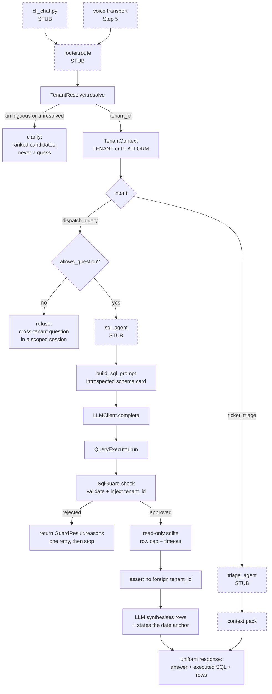
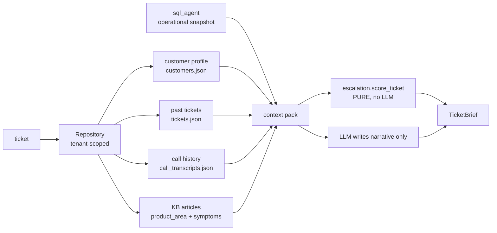
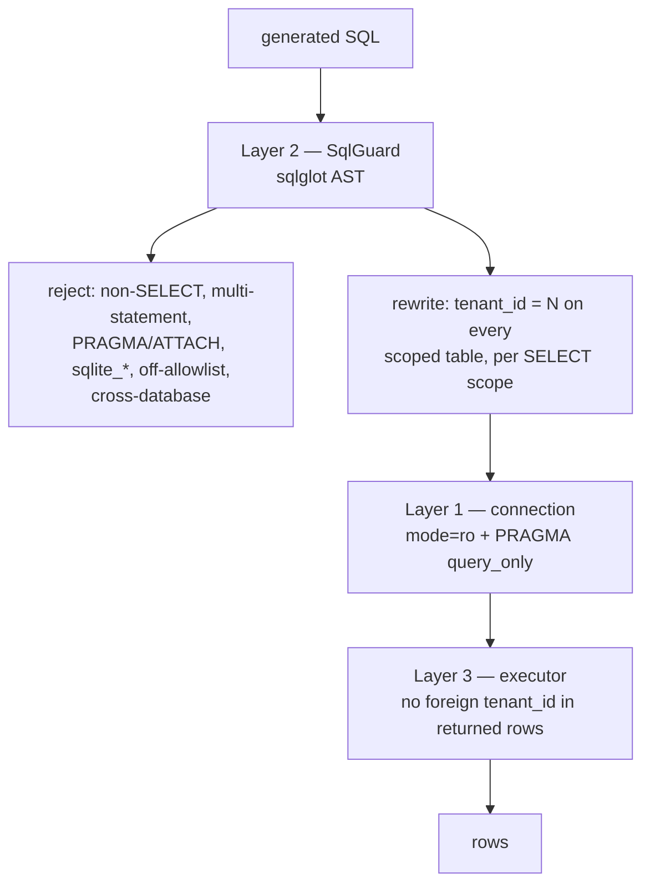

# DESIGN.md — how the pieces fit

The walkthrough script. `RECON.md` explains *why* the design is shaped this way;
`DECISIONS.md` records the contested choices; this file is the map you read while
tracing a request end to end.

**Status:** solid boxes are built and tested. Dashed boxes are stubs whose module
docstrings carry their specification (Step 4).

---

## 1. Two flows, one core

Chat and voice are transports. Everything below `route()` is shared, which is what
makes "same intelligence in both modes" a structural property rather than a
promise (CLAUDE.md §2).

The two refusal paths are the interesting part and they refuse for different
reasons. `CLARIFY` fires when we do not know *who* is being asked about.
`REFUSE` fires when we know exactly who, and this session is not allowed to ask
across all of them. Collapsing them into one "sorry" would lose that.

## 2. The triage fan-in

Five sources, all tenant-scoped through the same repository, plus deterministic
scoring that the LLM does not participate in.

The split at the bottom is deliberate and is CLAUDE.md §3.4: escalation level is
computed from scored signals, and the LLM is handed that level and asked to
explain it. A model asked to weigh health score against CARR against contract
proximity gives a different answer on Tuesday, and "why was this escalated" has to
be answerable from code.

Every section degrades to empty rather than failing: `billing` tickets have no KB
article at all, and six of twelve tenants have no `tank_readings` rows.

## 3. Tenant isolation, three layers

Each layer assumes the others may fail, and they fail differently on purpose:

| Layer | Enforced by | Catches | Blind to |
|---|---|---|---|
| 1 read-only connection | SQLite itself | any write, even one the guard missed | cross-tenant *reads* |
| 2 AST guard | our code | scope, table access, missing predicates | its own bugs |
| 3 row assertion | our code | a guard bug, in real data | leaks past the row cap |

Layer 3 is a smoke alarm, not a second guard —
`test_the_row_assertion_is_a_detector_not_a_guarantee` pins that ceiling, and
OPEN_QUESTIONS Q-010 argues against adding a fourth layer to close it.

The reason there are three and not one: during Step 2, sqlglot 30's rename of the
`Select` node's `from` argument to `from_` made the injection pass find no tables.
It emitted syntactically perfect, entirely unfiltered SQL. Layer 2 was the layer
that failed, so only layers 1 and 3 could have caught it. See DECISIONS.md D-004.

## 4. Why each module is its own file

The rule is one reason to change per file. Concretely:

| Module | Owns | Changes when |
|---|---|---|
| `config.py` | every path, threshold, mapping | a number or a domain fact changes — and nowhere else does |
| `data/loaders.py` | the shape of the vendor's JSON | a field is renamed in `data/` |
| `data/resolver.py` | name → id, and refusing | the alias strategy changes |
| `data/sources.py` | the registry | a source is **added** — one line, no agent edits |
| `data/repository.py` | tenant filtering for JSON | never, ideally; it is the one place to audit |
| `db/connection.py` | how the database is opened | the read-only story changes |
| `db/schema.py` | what the prompt knows about the DB | the schema changes |
| `db/guard.py` | what SQL is allowed to be | the threat model changes |
| `db/executor.py` | resource limits and the final check | limits change |
| `agent/session.py` | who is asking and what they may see | a third scope appears (end-customers) |
| `llm/prompts.py` | every system prompt | prompt tuning — in one place, for the walkthrough |

Two seams carry the "extend without editing agent logic" requirement:

- **`sources.REGISTRY`** — a sixth data source is a loader plus one registry line.
  `Repository.records_for` serves it immediately, because filtering is generic over
  the registry rather than written per source.
- **`TenantContext`** — a third scope (FleetPanda → tenant → end-customer) is a new
  enum member plus its rule in `allows_question`. The guard already takes its
  predicate from the context rather than from a caller-supplied id.

`ResolvedNameSource` is the reason `tenant_id_of` is a *function* on the source
rather than an attribute read: call transcripts carry a name, not an id, so theirs
resolves. That difference is contained in one class and is invisible to every
caller — which is the registry earning its place rather than being ceremony.

## 5. Where to look, during a walkthrough

| Question | File and function |
|---|---|
| "Show me tenant isolation" | `db/guard.py:_inject_tenant_predicates` — read the docstring, then `_direct_sources` |
| "How do you know it works?" | `tests/test_tenant_isolation.py` — the bypassed-guard test is the one to open |
| "How does entity resolution feed the SQL agent?" | `data/resolver.py:resolve` → `agent/session.py:TenantContext` → `db/guard.py` takes the id from the context |
| "Why does it refuse this?" | `session.py:allows_question` (authority) vs `guard.py` reasons (the SQL itself) |
| "What did the data look like?" | `RECON.md` §2 and §6 |
| "Why not a vector DB?" | `agent/triage_agent.py` docstring — 12 articles |
| "Why not LangChain?" | `llm/client.py` — 78 lines, one provider, no indirection |

## 6. What is not designed yet

Voice mode (Step 5) beyond the observation that latency lives on the intent-
classification path and that `ResolutionResult.needs_confirmation` already exists
to drive read-back. The response schema is prose-only today — OPEN_QUESTIONS Q-007
argues it should carry `window_start` / `window_end` / `anchor_mode` once the
triage brief forces a structured response model into existence.
