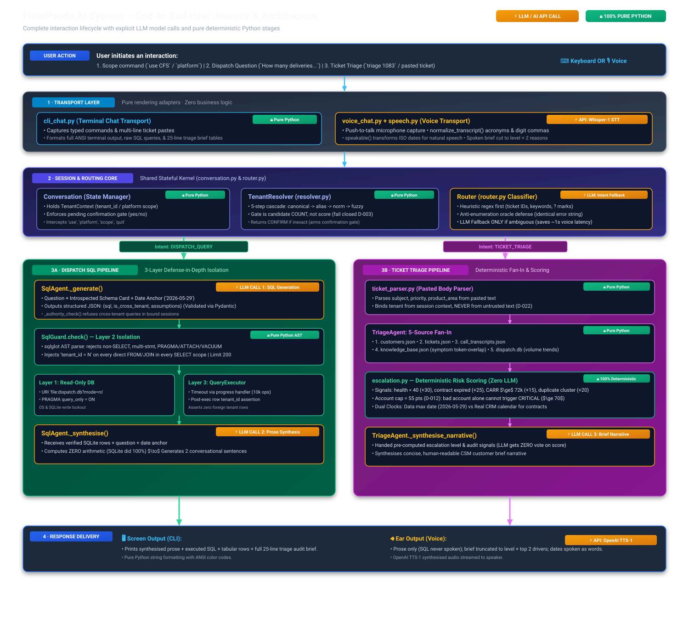
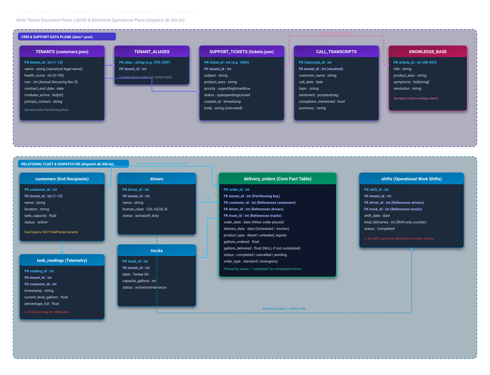
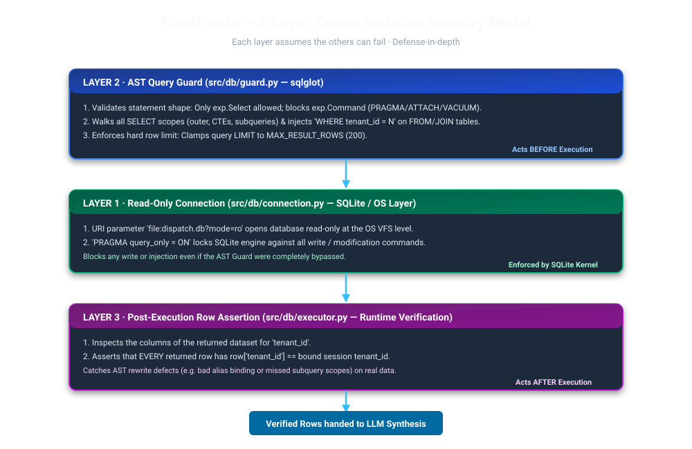

# System Architecture & Entity-Relationship (ER) Diagrams

This document provides visual architectural diagrams, database schema models, the end-to-end user journey, and the structural rationale underpinning the FleetPanda AI Support Agent.

---

## 1. End-to-End User Journey & System Architecture Diagram



---

## 2. The Complete End-to-End User Journey & LLM Call Inventory

Every request follows a deterministic, 5-stage lifecycle. The table below catalogues where AI models are used versus where pure Python deterministic code is strictly enforced:

```mermaid
journey
    title End-to-End User Journey across FleetPanda AI System
    section 1. Input & Transport
      User Speaks / Types: 5: User
      Whisper-1 STT [LLM/API]: 4: Voice Transport
      normalize_transcript() [Pure]: 5: Voice Transport
    section 2. Session & Routing
      Pending Confirmation Gate [Pure]: 5: Conversation
      Tenant Resolution Cascade [Pure]: 5: TenantResolver
      Intent Classification [Heuristic/LLM]: 4: Router
    section 3A. Dispatch SQL Path
      SQL Generation [LLM Call 1]: 4: SqlAgent
      _authority_check() [Pure]: 5: SqlAgent
      SqlGuard AST Rewrite (Layer 2) [Pure]: 5: SqlGuard
      Read-Only SQLite Query (Layer 1) [Pure]: 5: SQLite
      Post-Exec Row Assertion (Layer 3) [Pure]: 5: QueryExecutor
      Prose Synthesis (Zero Math) [LLM Call 2]: 4: SqlAgent
    section 3B. Support Triage Path
      Ticket Header Parsing [Pure]: 5: ticket_parser
      5-Source CRM/DB Fan-In [Pure]: 5: TriageAgent
      Deterministic Risk Scoring (Cap 55) [Pure]: 5: escalation.py
      KB Symptom Match [Pure]: 5: Repository
      Brief Narrative Synthesis [LLM Call 3]: 4: TriageAgent
    section 4. Delivery
      Screen Markdown/ANSI Output [Pure]: 5: cli_chat
      speakable() Formatting [Pure]: 5: voice_chat
      OpenAI TTS-1 Audio [LLM/API]: 4: SpeechClient
```

### Explicit Model Invocations vs. Pure Python Boundaries

| Lifecycle Stage | Component | Execution Mechanism | Role & Architectural Context |
|---|---|---|---|
| **Audio Capture** | `src/interfaces/speech.py` | ⚡ **LLM/API (`whisper-1`)** | Transcribes raw microphone audio. Primed with domain phrases (e.g. *Cascade Fuel Services*, *CFS*, *tank monitor*) to reduce transcription error rate. |
| **Audio Cleaning** | `src/interfaces/voice_chat.py` | 🔒 **100% Pure Python** | `normalize_transcript()` strips digit grouping commas (`"1,083"` $\to$ `"1083"`), collapses spelled acronym runs $\ge 3$ (`"C F S"` $\to$ `"CFS"`), and formats spoken tenant numbers (`"tenant three"` $\to$ `"tenant 3"`). |
| **Session Control** | `src/agent/conversation.py` | 🔒 **100% Pure Python** | Holds `TenantContext` (`is_bound`, `tenant_id`). Enforces the pending confirmation gate (`yes`/`no`) before any data query is executed (D-018). |
| **Entity Resolution** | `src/data/resolver.py` | 🔒 **100% Pure Python** | 5-step cascade (canonical $\to$ curated alias $\to$ normalized $\to$ rapidfuzz). Evaluates candidate **count** rather than raw score to fail-closed on ambiguity (D-003). |
| **Intent Classification** | `src/agent/router.py` | ⚡ **LLM Fallback (Optional)** | Regex heuristics first (`_TRIAGE_WORDS`, ticket patterns, `?`). Model invoked **only** if input is completely ambiguous, saving ~1s round-trip latency on voice interactions. |
| **SQL Generation** | `src/agent/sql_agent.py` | ⚡ **LLM CALL 1 (`gpt-4o-mini`)** | Converts natural question + introspected schema card + date anchor (`2026-05-29`) into structured JSON `{sql, is_cross_tenant, assumptions}` (Validated via Pydantic model). |
| **SQL Authority Check** | `src/agent/sql_agent.py` | 🔒 **100% Pure Python** | `_authority_check()` blocks cross-tenant queries in bound sessions by inspecting intent flags and AST `GROUP BY` / `ORDER BY tenant_id`. |
| **AST SQL Guard** | `src/db/guard.py` | 🔒 **100% Pure Python (Layer 2)** | `sqlglot` AST traversal. Rejects non-SELECT / PRAGMA / ATTACH / `sqlite_*`. Injects `tenant_id = N` into every nested `exp.Select` scope. Clamps `LIMIT` to 200. |
| **Read-Only Database** | `src/db/connection.py` | 🔒 **OS / Engine (Layer 1)** | `file:dispatch.db?mode=ro` + `PRAGMA query_only = ON`. Hard write lockout even if the parser were bypassed. |
| **Execution & Assertion** | `src/db/executor.py` | 🔒 **100% Pure Python (Layer 3)** | Aborts runaway queries via SQLite bytecode progress handler (10,000 instructions budget). Asserts no returned row carries foreign `tenant_id`. |
| **Prose Synthesis** | `src/agent/sql_agent.py` | ⚡ **LLM CALL 2 (`gpt-4o-mini`)** | Converts verified SQLite result rows into a 2-sentence conversational answer. Computes **zero arithmetic** (SQLite computes 100%). |
| **Ticket Parsing** | `src/agent/ticket_parser.py` | 🔒 **100% Pure Python** | Parses pasted ticket headers. Binds tenant from session context, **never** from untrusted text (D-022). |
| **Triage Fan-In** | `src/data/repository.py` | 🔒 **100% Pure Python** | Fans in 5 sources (`customers.json`, `tickets.json`, `call_transcripts.json`, `knowledge_base.json`, `dispatch.db`). |
| **Escalation Scoring** | `src/agent/escalation.py` | 🔒 **100% Pure Python (Zero LLM)** | Pure scoring functions (D-010). Account risk capped at 55 pts (D-012). Dual clocks: historical data clock (`2026-05-29`) vs real CRM calendar date. |
| **Triage Narrative** | `src/agent/triage_agent.py` | ⚡ **LLM CALL 3 (`gpt-4o-mini`)** | Handed the pre-calculated level and audit signals. Writes 1-paragraph CSM narrative (LLM gets zero vote on score). |
| **Audio Synthesis** | `src/interfaces/speech.py` | ⚡ **LLM/API (`tts-1`)** | Streams spoken prose (`speakable()` formatted dates & pauses) to the user's speaker. |

---

## 3. Complete Entity-Relationship (ER) Diagram



### Data Plane Structure & Cross-Domain Schemas

#### A. Multi-Tenant CRM Data Plane (`data/*.json`)
* **`TENANTS` (`customers.json`)**: Partitioning root (`tenant_id: 1..12`), CRM health scores (0–100), CARR ($), contract expiration dates, active module entitlements (`dispatch`, `pricing`, `tank_monitor`).
* **`TENANT_ALIASES` (`tenant_aliases.json`)**: Curated short-code mappings (e.g. `CFS` $\to$ 1, `DSP` $\to$ 4).
* **`SUPPORT_TICKETS` (`tickets.json`)**: 4-digit ticket records (`#1001`..`#1084`), subject lines, product areas, priorities, statuses, and free-text bodies.
* **`CALL_TRANSCRIPTS` (`call_transcripts.json`)**: Account call logs, sentiment analysis (`positive`, `neutral`, `negative`), and competitor mentions.
* **`KNOWLEDGE_BASE` (`knowledge_base.json`)**: Troubleshooting articles (`KB-001`..`KB-012`), tagged symptom keywords, and standard resolutions.

#### B. Relational Fleet & Dispatch Database (`dispatch.db`)
* **`customers`**: End-clients receiving fuel (fuel recipients, **not** FleetPanda tenants). Partitioned by `tenant_id`.
* **`drivers`**: Commercial drivers (`CDL-A`, `CDL-B`). Partitioned by `tenant_id`.
* **`trucks`**: Fuel delivery tankers and gallon capacities. Partitioned by `tenant_id`.
* **`delivery_orders`**: Primary operational fact table. Contains order and scheduled delivery dates, fuel types (`diesel`, `unleaded_regular`), gallons ordered/delivered, and order status (`completed`, `cancelled`, `pending`).
* **`shifts`**: Driver/truck shift assignments. `shifts.total_deliveries` is a shift counter that does not reconcile with completed orders.
* **`tank_readings`**: Customer tank telemetry levels. Exhibits a 9x fan-out relative to customers.

---

## 4. Three-Layer Tenant Isolation Security Model



### Layer Comparison & Threat Matrix

| Layer | Component | Enforced By | Mechanism | Threats Mitigated |
|---|---|---|---|---|
| **Layer 1** | Connection | OS / SQLite Engine | `file:dispatch.db?mode=ro` + `PRAGMA query_only = ON` | Any write statement (`INSERT`, `UPDATE`, `DELETE`, `DROP`, `ALTER`), even if missed by the AST parser. |
| **Layer 2** | AST Guard | `src/db/guard.py` | `sqlglot` AST traversal injecting `tenant_id = N` into every `exp.Select` scope | Cross-tenant data leaks, unauthorized tables, `PRAGMA`/`ATTACH` commands, unbounded queries. |
| **Layer 3** | Row Assertion | `src/db/executor.py` | Runtime row validation | Guard rewrite defects or alias mapping failures in returned data. |

---

## 5. Architectural Decisions Reference (ADR) Mapping

The design decisions visualized above map to the following foundational engineering records:

- **[D-001](../../DECISIONS.md#D-001)**: Dynamic Schema Introspection & Temporal Anchor (`2026-05-29`). Prevents `date('now')` returning empty result sets against historical snapshots.
- **[D-003](../../DECISIONS.md#D-003)**: Candidate Count Gating for Entity Resolution. Protects against subset token scoring leaks (`"Fuel"` probe).
- **[D-004](../../DECISIONS.md#D-004)**: AST Injection for Multi-Tenant Isolation via `sqlglot`.
- **[D-007](../../DECISIONS.md#D-007)**: Two-Call LLM Split. Separation of creative query generation from strict, zero-math prose synthesis.
- **[D-010](../../DECISIONS.md#D-010)**: Deterministic Escalation Scoring in Pure Python.
- **[D-012](../../DECISIONS.md#D-012)**: 55-Point Account Risk Cap. Ensures struggling accounts alone top out at `URGENT`, requiring ticket-specific urgency for `CRITICAL`.
- **[D-018](../../DECISIONS.md#D-018)**: Shared Multi-Turn `Conversation` Session Kernel across CLI and Voice.
- **[D-022](../../DECISIONS.md#D-022)**: Pasted Ticket Routing with Session Scope Binding (Prevents spoofed company header escalation).
