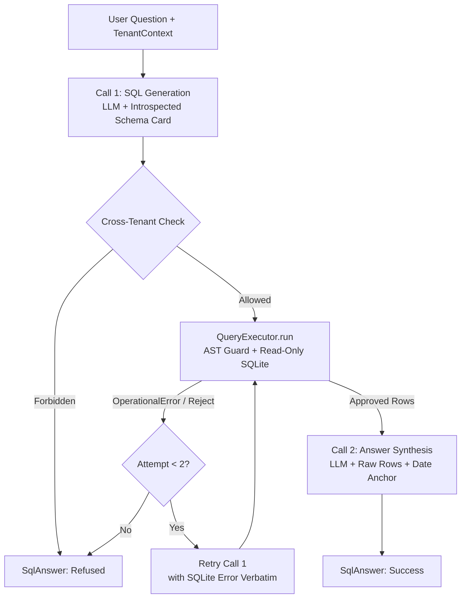

# Spec — SQL Dispatch Agent

← [README](../../README.md) · [Architecture decisions](../explanation/architecture-decisions.md) · Sibling specs: [tenant isolation](tenant-isolation.md) · [ticket triage](ticket-triage.md) · [entity resolution](entity-resolution.md) · [voice interface](voice-interface.md)

**Status:** implemented and tested (`tests/test_sql_agent.py`, `tests/test_sql_questions.py`). The SQL Dispatch Agent translates natural language operational questions into guarded SQLite queries and synthesises formatted answers for chat and voice interfaces.

---

## 1. Contract & Data Model

`src/agent/sql_agent.py`.

```
Router.route(text, context)
  └── Intent.DISPATCH_QUERY → SqlAgent.answer(question, context)
        ├── 1. Generate SQL (LLM Call 1 with Schema Card + Prompt Caching)
        ├── 2. Authority Check (Cross-tenant intent gate)
        ├── 3. Execute via Guard & Read-Only DB (AST rewrite + Row assertion)
        │     └── If SQLite / Guard Error: Single Retry with error verbatim
        └── 4. Synthesise Answer (LLM Call 2 with raw rows + date anchor)
              └── Returns SqlAnswer
```

### Inputs & Outputs

- **Input:** 
  - `question: str` — Natural language user query.
  - `context: TenantContext` — Authority object (`TENANT` with `tenant_id` or `PLATFORM`).
- **Intermediate Structured Output:**
  - `SqlGeneration` (Pydantic model) — Validated LLM response containing `sql: str`, `is_cross_tenant: bool`, `assumptions: str`.
- **Output:**
  - `SqlAnswer` (Frozen Dataclass) — The typed result containing `answer`, `sql`, `rows`, `columns`, `date_anchor`, `anchor_mode`, `refused`, and `refusal_reasons`.

```python
@dataclass(frozen=True, slots=True)
class SqlAnswer:
    question: str
    answer: str
    refused: bool = False
    refusal_reasons: tuple[str, ...] = ()
    sql: str | None = None
    columns: tuple[str, ...] = ()
    rows: tuple[tuple[Any, ...], ...] = ()
    row_count: int = 0
    truncated: bool = False
    attempts: int = 1
    date_anchor: str | None = None
    anchor_mode: str | None = None
```

---

## 2. The Two-Call Architecture

To guarantee accuracy and eliminate hallucinations, question answering is strictly divided into **two non-overlapping LLM calls** (D-007):



### Call 1: SQL Generation (Creative)
- **Role:** Translates the natural language question into standard SQLite.
- **Rules:** The system prompt explicitly commands the model **not** to write tenant filters (e.g., `WHERE tenant_id = X`), because tenant predicate injection is handled deterministically by the AST Guard.
- **Prompt Caching:** Enabled on the system prompt (`cache_system=True`) to cache the static schema card across queries.

### Call 2: Answer Synthesis (Fact-Constrained)
- **Role:** Translates database rows into 2–3 concise sentences.
- **Rules:** The model is prohibited from computing new numbers, performing aggregations, or guessing missing values. It receives exact row tuples and formats them directly.
- **Distribution Summarization:** When results contain multi-row distributions (e.g. fill rates across all tenants), the model summarizes with the range (min/max), key leaders, or averages rather than reciting long raw enumerations. Designed for both screen and voice playback.

---

## 3. Two-Phase Cross-Tenant Authority Check

In a scoped session (`context.is_bound == True`), cross-tenant queries (e.g., *"Which tenant has the highest volume?"*) must be **refused** rather than silently filtered to the active tenant (D-008). 

The agent verifies authority through two independent mechanisms before running SQL:

1. **Semantic Flag (`generation.is_cross_tenant`)**: The model flags questions that inherently ask for comparisons across accounts.
2. **Structural AST Check (`_looks_cross_tenant(sql)`)**: The generated SQL is parsed with `sqlglot` to detect any `GROUP BY` or `ORDER BY` clauses on `tenant_id`.

If either check triggers in a tenant-scoped session, the agent refuses execution with an explanatory reason.

---

## 4. Schema Introspection & The Two Clocks

`src/db/schema.py`.

The database schema is not hardcoded; it is introspected on cold start via `introspect()` and cached via `@lru_cache`:
- Extracts table definitions, column types, and foreign key relationships.
- Identifies the maximum timestamp in the database (`2026-05-29`) as the **Date Anchor** (D-001).

### The Two Clocks Problem
Because real-world operational datasets end at a fixed snapshot date:
- **Contract & SLA math** (e.g., *"Is this customer within contract?"*) uses real wall-clock time (`datetime.date.today()`).
- **Operational DB queries** (e.g., *"How many deliveries in the last 30 days?"*) use the anchor date `2026-05-29`.
- Every `SqlAnswer` attaches `date_anchor="2026-05-29"` and `anchor_mode="max_data_date"`, allowing transports to explain data freshness to users.

---

## 5. Error Handling & Single-Retry Lifecycle

`SqlAgent.answer()` is guaranteed **never to raise uncaught exceptions** on bad SQL or missing columns.

```python
# One retry with exact error feedback
for attempt in range(1, config.SQL_MAX_ATTEMPTS + 1):
    generation = self._generate(system, user)
    verdict, result = self._executor.run(generation.sql, context)
```

1. **Attempt 1:** The generated SQL is sent to `QueryExecutor.run()`.
2. **If SQLite fails (e.g., `sqlite3.OperationalError: no such column`):**
   - The query and SQLite's exact error message are fed back into `prompts.SQL_RETRY_TEMPLATE`.
3. **Attempt 2:** The model receives its own failed SQL + error reason to produce a corrected query.
4. **If Attempt 2 fails:** Execution terminates cleanly with `SqlAnswer(refused=True, refusal_reasons=...)`.

---

## 6. Prompt Caching & Performance

| Stage | Input Tokens | Output Tokens | Caching Mechanism |
|---|---:|---:|---|
| **Call 1 (SQL Generation)** | ~1,180 | ~120 | **Cached** (`cache_system=True` on 1,165-tok schema card) |
| **Call 2 (Synthesis)** | ~276 | ~90 | Uncached (Dynamic row payload) |
| **Total per Question** | **1,456** | **210** | **~26% total daily cost reduction** |

- **OpenAI:** Prefix caching triggers automatically for the 1,165-token schema prompt ($\ge 1,024$ tokens); cached token count is tracked via `prompt_tokens_details.cached_tokens`.

---

## 7. Security & Execution Boundaries

The SQL Agent delegates all execution and AST modifications to lower layers to maintain strict separation of concerns:

- **Security & Rewrite:** Detailed in [Multi-Tenant Isolation Spec](tenant-isolation.md). `SqlGuard` (Layer 2) parses AST via `sqlglot` and injects `tenant_id` filters.
- **Execution & Isolation Check:** `QueryExecutor` (Layer 3) runs queries against read-only SQLite connections ([Layer 1](tenant-isolation.md#L3-layer-isolation-model)) with timeouts, row caps (`config.SQL_ROW_LIMIT = 50`), and asserts no foreign `tenant_id` is present in results.

---

## 8. Module Collaboration Map

| File | Role in SQL Agent Pipeline |
|---|---|
| [`src/agent/sql_agent.py`](../../src/agent/sql_agent.py) | Main orchestrator: 2-call flow, prompt assembly, cross-tenant check, retry loop |
| [`src/db/schema.py`](../../src/db/schema.py) | DB introspection, schema card generation, anchor date extraction |
| [`src/db/guard.py`](../../src/db/guard.py) | AST security inspection, table allowlist, tenant predicate rewrite |
| [`src/db/executor.py`](../../src/db/executor.py) | Query execution with row cap, timeout, and Layer 3 row leak assertion |
| [`src/llm/prompts.py`](../../src/llm/prompts.py) | System prompts, retry template, and JSON schemas |
| [`src/llm/client.py`](../../src/llm/client.py) | Provider completion wrapper and prompt caching |
