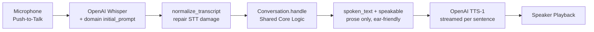

# Spec — Voice Interface & Speech Pipeline

← [README](../../README.md) · [Architecture decisions](../explanation/architecture-decisions.md) · Sibling specs: [tenant isolation](tenant-isolation.md) · [SQL agent](sql-agent.md) · [ticket triage](ticket-triage.md) · [entity resolution](entity-resolution.md)

**Status:** implemented and tested (`tests/test_voice.py`). The Voice transport provides an audio interface sharing the identical agent core as the CLI chat, with specialized rendering rules for the ear. Latency and recognition were tuned in a later pass (see [D-026](../explanation/decisions-log.md)): the Whisper decoder is primed with domain vocabulary, TTS is streamed sentence by sentence, and an offline macOS `say` fallback lets the loop run without an API key.

---

## 1. Audio Loop Architecture

`src/interfaces/voice_chat.py` & `src/interfaces/speech.py`.



When `OPENAI_API_KEY` is absent (or a synthesis call fails), the transport drops to an **offline path**: the turn is typed instead of spoken, and playback goes through the macOS `say` command. There is no offline speech-to-text, so this is a dev/demo path, not a second transport.

### Turn Lifecycle

1. **Input (`_listen`)**:
   - Online: push-to-talk recording (`record_until_enter`) captures 16 kHz mono PCM until the user presses Enter — chosen over silence detection to eliminate false cut-offs in noisy rooms ([D-020](../explanation/decisions-log.md)).
   - Offline: the turn is typed at the prompt. Both paths end in `normalize_transcript`, so nothing downstream can tell how the words arrived.
2. **Transcription (`transcribe`)**:
   - Sends the WAV to OpenAI Whisper with `language="en"` pinned and an `initial_prompt` built from tenant names, aliases, and domain jargon — priming the decoder to emit "CFS"/"TankLink" correctly at the source (see §4).
3. **Transcript repair (`normalize_transcript`)**:
   - Un-mangles what STT reliably does to our inputs before the router sees them (see §3).
4. **Core Turn Processing (`Conversation.handle`)**:
   - Feeds the repaired transcript into [`Conversation.handle()`](../../src/agent/conversation.py) — the same core the CLI chat uses.
5. **Rendering for the ear (`spoken_text` → `speakable`)**:
   - Selects prose only (never SQL), condenses a brief, and rewrites screen-only prose for audio (see §2).
6. **Speech Synthesis (`speak`)**:
   - Calls OpenAI TTS (`tts-1`, voice `nova`, `speed=1.08`) and streams playback sentence by sentence, so the first words are heard while the rest are still synthesizing.

---

## 2. Rendering Rules for the Ear

`speakable`, `spoken_text`, and `normalize_transcript` all live in `src/interfaces/voice_chat.py`; the SDK calls and playback live in `src/interfaces/speech.py`.

Audio interfaces cannot tolerate dense tables, markdown, or raw SQL. Two functions turn a `RouterResponse` into something hearable:

### A. Prose Only, Never SQL (`spoken_text`)
- The screen carries the evidence; the voice carries the answer. `spoken_text` speaks `response.text` (the synthesized factual answer) and never `sql_answer.sql`. A SELECT read aloud is unusable, so it is printed and never spoken.

### B. Ticket Brief Condensation (`spoken_text` → `_spoken_brief`)
- A complete ~25-line triage brief is compressed to its decision:
  - **Level & score:** *"Ticket 1083 for … is critical, score 82."*
  - **Top reasons:** the strongest `SPOKEN_BRIEF_MAX_REASONS` (2) signals — "why" is the next question a human asks.
  - It **points at the screen** ("The full brief is on screen.") rather than offering a follow-up this transport does not implement.

### C. Spoken Prose Rewrite (`speakable`)
- **ISO dates:** `YYYY-MM-DD` is a run of digits and dashes read aloud, so it is rewritten to spoken form — `"2026-05-29"` → `"29 May 2026"`. An impossible month (e.g. `2026-13-01`) is left as-is, failing closed.
- **House-style aside:** ` -- ` (our printed dash) is read as characters by some voices, so it becomes `", "`.
- Refusals, clarifications, and confirmations are spoken verbatim — they are already short and already written for a human, and rewording them would be a second place for a refusal's meaning to drift.

---

## 3. Transcript Repair (`normalize_transcript`)

Speech-to-text reliably damages our short, structured inputs; each repair is deliberately narrow so it cannot fire on ordinary speech.

| STT produces | Repaired to | Why |
|---|---|---|
| `use C F S` (spelled-out code) | `use CFS` | The alias table has `CFS`; the resolver normalizes case but not spacing. Collapses runs of ≥3 single letters only. |
| `ticket 1,083` (grouping comma) | `ticket 1083` | The ticket parser's `\d+` was splitting `1` and `083`. Strips only digit-adjacent commas. |
| `tenant three` (dictated number) | `tenant 3` | The SQL prompt and router expect the digit. Maps number words 0–12, but only right after `tenant`, so prose "three" is untouched. |
| `Platform.` (trailing punctuation) | `Platform` | `"Platform."` is not the `platform` command. A trailing `?` is kept — the router reads it as evidence of a question. |

---

## 4. Latency & Recognition ([D-026](../explanation/decisions-log.md))

The transport is deliberately **not** a three-agent streaming pipeline ([D-019](../explanation/decisions-log.md)); only the one stage that overlaps was optimized.

- **Domain-primed Whisper (`_build_speech_prompt`):** the `initial_prompt` is assembled at startup from `load_tenants()` + `load_tenant_aliases()` + `config.SPEECH_PROMPT_JARGON`, so a new tenant or alias needs no code edit. Terms are ordered names → aliases → jargon so the acronyms most likely to be misheard survive Whisper's ~224-token prompt truncation.
- **Sentence-streamed TTS (`SpeechClient._speak_streaming`):** a bounded producer thread synthesizes the next sentence while the current one plays. Time-to-first-audio becomes the cost of the first sentence (~0.4–0.6 s) instead of the whole answer (~1.5–2.5 s on a brief). A synthesis failure mid-answer is carried back and degrades to `say`.
- **Playback speed (`config.TTS_SPEED = 1.08`):** ~7% less listening time, imperceptible as "fast".
- **Offline fallback (`_say`, offline branch in `SpeechClient.__init__`):** no key, or a failed synthesis call, degrades to macOS `say` (WPM scaled by `TTS_SPEED`); the loop reads typed input.

---

## 5. Voice Safety & Acoustic Confirmation Gate

Dictated speech is prone to phonetic misrecognition. The gate is inherited from `Conversation`, not reimplemented in the transport — the property the chat/voice split exists for.

1. The resolver classifies an inexact match as `MatchMethod.FUZZY` (or `NORMALIZED`).
2. The conversation engine sets `pending_tenant` and asks for confirmation: *"Did you mean Cascade Fuel Services (tenant 1)? Say yes to continue."*
3. The next spoken turn is validated against the strict `AFFIRMATIVES` list:
   ```python
   AFFIRMATIVES = frozenset({
       "yes", "y", "yeah", "yep", "yup", "correct", "that's right", "thats right",
   })
   ```
4. Anything other than a clear affirmative — a hedge, silence, a new question, or "no" — **cancels** the pending tenant, keeping the session safely in its previous scope. A STT engine that mishears a company name will also mishear a hedge, so the list is kept narrow on purpose.

---

## 6. Module Map

| File | Responsibility |
|---|---|
| [`src/interfaces/voice_chat.py`](../../src/interfaces/voice_chat.py) | Turn loop (`_listen`, online/offline), push-to-talk prompts, `normalize_transcript`, `speakable`, `spoken_text` |
| [`src/interfaces/speech.py`](../../src/interfaces/speech.py) | `sounddevice` capture, Whisper STT (+ `initial_prompt`), streamed TTS, `say` fallback |
| [`src/agent/conversation.py`](../../src/agent/conversation.py) | Shared stateful session engine and acoustic confirmation gate |
