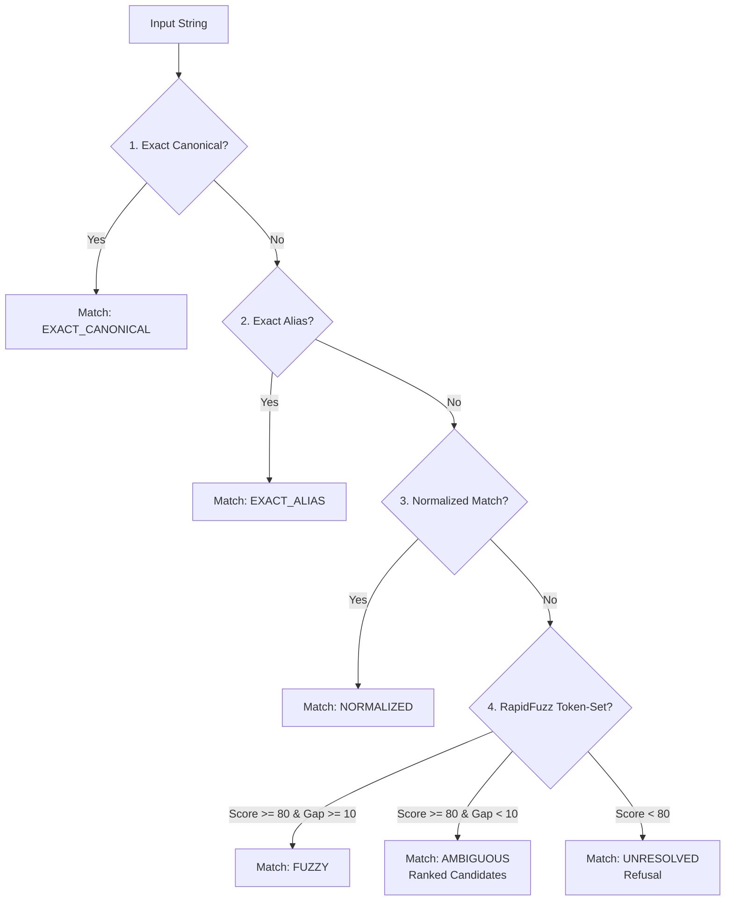

# Spec — Entity Resolution & Request Routing

← [README](../../README.md) · [Architecture decisions](../architecture_decisions.md) · Sibling specs: [tenant isolation](tenant_isolation_spec.md) · [SQL agent](sql_agent_spec.md) · [ticket triage](ticket_triage_agent_spec.md)

**Status:** implemented and tested (`tests/test_entity_resolution.py`, `tests/test_router.py`, `tests/test_conversation.py`). This specification defines how natural language tenant names and user utterances are resolved to canonical IDs, gated for human confirmation, and routed to specialized agents.

---

## 1. The Entity Resolution Cascade

`src/data/resolver.py`.

Tenant name resolution is the **first security boundary** in the system. Downstream layers (including the AST SQL Guard and Repository) trust the resolved integer `tenant_id`. A mistake here is a cross-tenant leak that cannot be caught later.

To ensure safety, `TenantResolver.resolve()` runs a deterministic, 5-stage cascade:



### Cascade Stages

1. **Exact Canonical Match (`EXACT_CANONICAL`)**:
   - Matches verbatim against `customers.json` official legal names (e.g., `"Cascade Fuel Services"` $\rightarrow$ `1`).
2. **Exact Known Alias (`EXACT_ALIAS`)**:
   - Matches against curated business abbreviations in `tenant_aliases.json` (e.g., `"CFS"` $\rightarrow$ `1`, `"Pinnacle"` $\rightarrow$ `3`).
3. **Normalized Match (`NORMALIZED`)**:
   - Strips corporate suffixes (`LLC`, `Inc`, `Corp`, `Co`), casing, and punctuation (e.g., `"cascade fuel services llc"` $\rightarrow$ `1`).
4. **Fuzzy String Matching (`FUZZY`)**:
   - Uses `rapidfuzz.fuzz.token_set_ratio` over normalized strings to tolerate typos, phonetic misspellings, or dictated speech.
   - **Threshold:** Score must be $\ge 80$.
   - **Margin Check:** The top match score must lead the second-best score by at least $10$ points (`score_gap >= config.RESOLVER_SCORE_MARGIN`).
5. **Ambiguous / Unresolved (`AMBIGUOUS` / `UNRESOLVED`)**:
   - If multiple candidates have similar high scores, the resolver returns `AMBIGUOUS` with ranked `Candidate` tuples.
   - If no candidate reaches 80, it returns `UNRESOLVED`.

---

## 2. The Pending Confirmation Security Gate

`src/agent/conversation.py`.

A fuzzy or inexact match must **never automatically bind a tenant context**. 

```
User: "Use Cascad Fuel" 
  └── Match: FUZZY (Score: 92) → "Did you mean Cascade Fuel Services (tenant 1)?"
        ├── User: "yes" / "correct" → Binds TenantContext(tenant_id=1)
        └── User: "no" / anything else → Cancels confirmation, scope unchanged
```

### Confirmation Invariants

- **Exact Matches (`EXACT_CANONICAL`, `EXACT_ALIAS`, `NORMALIZED`):** Bound immediately without conversational friction.
- **Fuzzy Matches (`FUZZY`):** Held in `conversation.pending_tenant = tenant_id`. The session remains on its previous scope until explicitly confirmed.
- **Strict Affirmation Set:**
  ```python
  AFFIRMATIVES = frozenset({
      "yes", "y", "yeah", "yep", "yup", "correct", "that's right", "thats right"
  })
  ```
- **Failsafe Cancellation:** Any non-affirmative reply (including silence, a new question, or `"no"`) immediately clears `pending_tenant` and prevents accidental account switching.

---

## 3. Stateless Intent Routing

`src/agent/router.py`.

The `Router` classifies incoming user text into typed intents (`Intent.DISPATCH_QUERY`, `Intent.TICKET_TRIAGE`, or `Intent.CLARIFY`). 

To minimize latency and token costs on the critical voice path, classification is **heuristic-first and LLM-last**:

```
Text Input
  ├── 1. Command Check (scope, platform, use <tenant>, quit) → Handled in Conversation
  ├── 2. Ticket Pattern Match (#1083, "ticket 1083", bare 4-digit number) → TICKET_TRIAGE (0 LLM Calls)
  ├── 3. Pasted Ticket Body (Labels or 2+ non-empty lines) → TICKET_TRIAGE (0 LLM Calls)
  ├── 4. Question Cue Words (how many, what, list, show, top...) → DISPATCH_QUERY (0 LLM Calls)
  └── 5. Genuine Ambiguity → LLM Intent Classifier (1 Fallback Call)
```

### Fast-Path Rules

1. **Explicit Ticket ID:** Regex matches `#?\b\d{4}\b` combined with cue words (`triage`, `escalate`) or bare line inputs.
2. **Pasted Ticket Detection:** [`ticket_parser.py`](../../src/agent/ticket_parser.py) detects multiline customer support pastes with standard headers (`Customer:`, `Priority:`, `Issue:`).
3. **Natural Question Detection:** Free-form questions starting with question words or ending with `?` route directly to `SqlAgent`.
4. **Fallback LLM Classification:** Only invoked when input is completely ambiguous (e.g. single ambiguous words with no clear intent).

---

## 4. Module Map

| File | Responsibility |
|---|---|
| [`src/data/resolver.py`](../../src/data/resolver.py) | 5-stage deterministic entity resolution and RapidFuzz scoring |
| [`src/agent/conversation.py`](../../src/agent/conversation.py) | Multi-turn state, `pending_tenant` confirmation gate, affirmation parsing |
| [`src/agent/router.py`](../../src/agent/router.py) | Stateless intent classifier, ticket extraction, and agent dispatch |
| [`src/agent/ticket_parser.py`](../../src/agent/ticket_parser.py) | Regex-based pasted ticket parsing and field extraction |
| [`src/agent/session.py`](../../src/agent/session.py) | `TenantContext` definition and RBAC question permissions |
