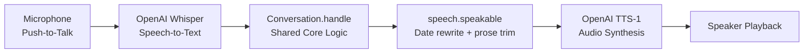

# Spec — Voice Interface & Speech Pipeline

← [README](../../README.md) · [Architecture decisions](../architecture_decisions.md) · Sibling specs: [tenant isolation](tenant_isolation_spec.md) · [SQL agent](sql_agent_spec.md) · [ticket triage](ticket_triage_agent_spec.md) · [entity resolution](entity_resolution_and_routing_spec.md)

**Status:** implemented and tested (`tests/test_voice.py`). The Voice transport provides an audio interface sharing the identical agent core as the CLI chat, with specialized rendering rules for the ear.

---

## 1. Audio Loop Architecture

`src/interfaces/voice_chat.py` & `src/interfaces/speech.py`.



### Turn Lifecycle

1. **Push-to-Talk Recording (`record_until_enter`)**:
   - Uses `sounddevice` to capture 16kHz mono PCM audio until the user presses Enter.
   - Push-to-talk is chosen over silence detection to eliminate false cut-offs in noisy environments.
2. **Transcription (`transcribe`)**:
   - Converts the audio buffer to WAV and sends it to the OpenAI Whisper API.
3. **Core Turn Processing**:
   - Feeds the transcript string into [`Conversation.handle()`](../../src/agent/conversation.py).
4. **Speech Sanitization (`speakable`)**:
   - Transforms structured prose into an ear-friendly format before speech generation.
5. **Speech Synthesis (`speak`)**:
   - Calls OpenAI TTS (`tts-1`, voice `alloy`) and plays back the resulting audio stream.

---

## 2. The `speakable()` Rendering Rules

`src/interfaces/speech.py`.

Audio interfaces cannot tolerate dense tables, markdown formatting, or raw SQL. `speakable()` sanitizes responses using three rules:

### A. Raw SQL & Code Stripping
- Blocks of SQL or technical formatting are stripped. A spoken SQL query wastes listener attention; voice users hear only the synthesized factual answer.

### B. Spoken Date Translation
- ISO date formats (e.g. `2026-05-29`) sound unnatural when read literally by TTS engines.
- Regex rewriting parses `YYYY-MM-DD` and formats it into conversational English:
  - `"2026-05-29"` $\rightarrow$ `"... as of May 29th, 2026"`

### C. Ticket Brief Condensation
- A complete 25-line triage brief is compressed into its core operational signals:
  - **Level:** *"This ticket is Escalation Level 3."*
  - **Top Reasons:** The two highest-scoring risk signals from `assessment.signals`.
  - **Action:** The recommended next step in one spoken sentence.

---

## 3. Voice Safety & Acoustic Confirmation Gate

Dictated speech is prone to phonetic misrecognition. If a user dictates a company name and Whisper mishears it:

1. The resolver classifies the match as `MatchMethod.FUZZY`.
2. The conversation engine sets `pending_tenant` and asks for acoustic confirmation: *"Did you mean Cascade Fuel Services (tenant 1)?"*
3. The next spoken turn is validated against the strict `AFFIRMATIVES` list:
   ```python
   AFFIRMATIVES = frozenset({
       "yes", "y", "yeah", "yep", "yup", "correct", "that's right", "thats right"
   })
   ```
4. If the acoustic input is ambiguous, a hedge, or anything other than a clear affirmative, the pending tenant is **cancelled**, keeping the session safely in its previous scope.

---

## 4. Module Map

| File | Responsibility |
|---|---|
| [`src/interfaces/voice_chat.py`](../../src/interfaces/voice_chat.py) | Audio turn orchestration, push-to-talk prompts, and voice turn loop |
| [`src/interfaces/speech.py`](../../src/interfaces/speech.py) | SoundDevice capture, OpenAI Whisper STT, OpenAI TTS, and `speakable()` sanitization |
| [`src/agent/conversation.py`](../../src/agent/conversation.py) | Shared stateful session engine and acoustic confirmation gate |
